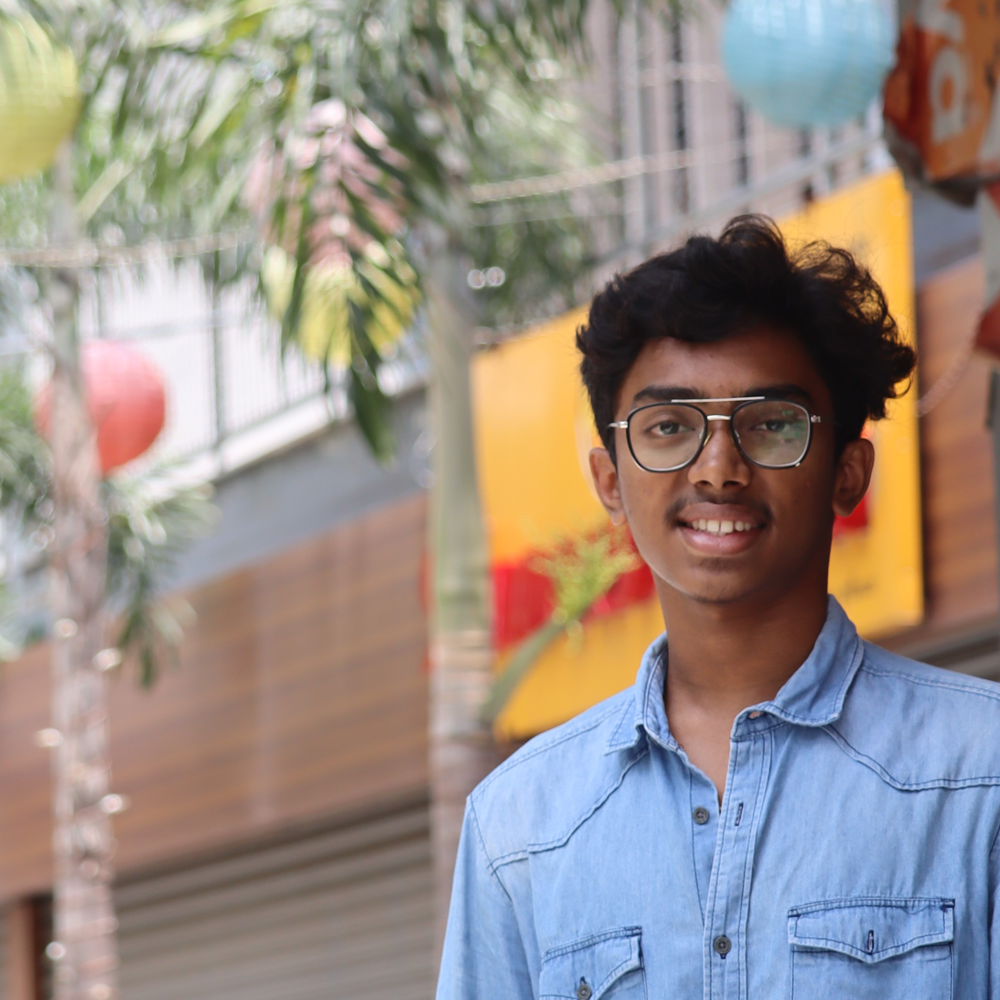
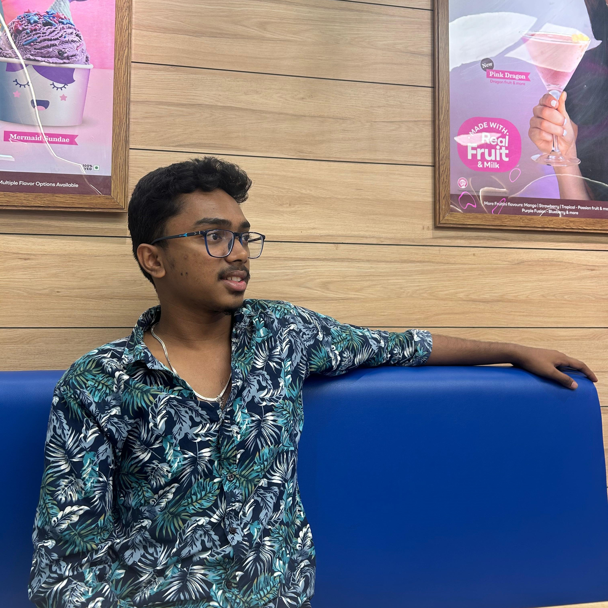

<head>
    <link rel="stylesheet" href="portfolio.css">
    <link rel="stylesheet" href="https://unpkg.com/boxicons@2.1.4/css/boxicons.min.css">
</head>
<body>
    <header id="header">
        <h1 id="heading">VAMSI PORTFOLIO</h1>
        <nav id="navbar">
            <ul>
                <li><a href="#first-page">Home</a></li>
                <li><a href="#main-content">About</a></li>
                <li><a href="#education">Education</a></li>
                <li><a href="#skills">Skills</a></li>
                <li><a href="#contact">Contact</a></li>
            </ul>
        </nav>
    </header>

    <section id="first-page">
        

            

                <h1>YOU ARE VISITING OUR PAGE</h1>
                <a>created by Mr.Vamsi</a>
                <h1>  ----------Lets get started----------</h1>
                <a>Lets explore vamsi's portfolio</a>
                <a>Let us begun</a>
            

            
        

    </section>

    <section id="main-content">
        <!-- Flex container for name and image -->
        

            <h1 class="name">JANGALA MOHANA SATYA VAMSI</h1>
            
        

        <!-- Information Box -->
        

            <h2>Hello, I’m Vamsi   I’m a Student</h2>
             
            
I am a dedicated software developer with a strong passion for web development. 
                With a knack for problem-solving and leadership, I excel in crafting efficient solutions and guiding teams towards success. 
                My journey is driven by a deep commitment to mastering the intricacies of modern web technologies and delivering impactful digital experiences.
            

        

        <!-- Call to Action (CTA) Button -->
        

            <a href="#" class="cta-button">Know More About Me</a>
            

                <a href="https://www.instagram.com/vamsi_j_royal/"><i class="bx bxl-instagram"></i></a>
                <a href="https://wa.me/qr/Y67K5L5G7S5VJ1"><i class="bx bxl-whatsapp"></i></a>
                <a href="https://www.linkedin.com/in/vamsi-jangala-5322162bb?utm_source=share&utm_campaign=share_via&utm_content=profile&utm_medium=ios_app"><i class="bx bxl-linkedin"></i></a>
                <a href="https://snapchat.com/t/niyScekN"><i class="bx bxl-snapchat"></i></a>
            

        

    </section>

    <section id="education">
              
        <h1 id="edu">My Education</h1>  
        

            

                

                    
<i class="bx bxs-school" id="logo"></i>

                    <h1>Schooling</h1>
                

                 
I completed my SSC (10th grade) education at Sree Lakshmi English Medium School in Nandyal, graduating in the 2019-2020 batch with an outstanding score of 93%. This foundational period instilled in me a disciplined approach to learning and a strong academic foundation in subjects essential for my future pursuits in computer science and engineering.      

            

            

                

                    
<i class="bx bxs-institution" id="logo1"></i>

                    <h1>Intermediate</h1>
                

                 
I completed my Intermediate education at Sri Chaitanya Junior College, achieving an impressive 91.4% in the board exams. This period nurtured my foundational knowledge in mathematics, physics, and computer science, laying a robust groundwork for my academic journey in engineering. The rigorous curriculum and supportive environment at Sri Chaitanya honed my analytical skills and fostered a strong passion for exploring the intersections of technology and problem-solving.                

            

            

                

                    
<i class="bx bxs-institution" id="logo"></i>

                    <h1>Engineering</h1>
                
    
                 
I am currently pursuing my Bachelor's degree in Computer Science and Engineering at SASTRA Deemed University, entering my third year. My coursework focuses on advanced topics in programming, algorithms, and software development, preparing me with practical skills and theoretical knowledge essential for a career in technology. I am enthusiastic about exploring emerging trends in the field and applying them to real-world solutions.                

            

        

    </section>

    <section id="skills">
        <h1 id="ski">My Skills</h1> 
            
        

            
   
                

                    <h1>Java</h1>  
                    <h1>HTML</h1>  
                    <h1>CSS</h1>
                

                

                    

                        <a></a>
                        <a></a> 
                        <a class="percentage">80%</a>
                    

                    

                        <a></a>
                        <a></a> 
                        <a class="percentage">80%</a>
                    

                    

                        <a></a>
                        <a></a> 
                        <a class="percentage">80%</a>
                    

                

            

            
   
                

                    <h1>Python</h1>  
                    <h1>DJango</h1>  
                    <h1>SQL</h1>
                

                

                    

                        <a></a>
                        <a></a> 
                        <a class="percentage">80%</a>
                    

                    

                        <a></a>
                        <a></a> 
                        <a class="percentage">80%</a>
                    

                    

                        <a></a>
                        <a></a> 
                        <a class="percentage">80%</a>
                    

                

            

        
        
    </section>

    <section id="contact" style="margin-bottom: 180px;">
        

            <h1 style="font-size: 50px; color: rgb(106, 0, 148); background-color: aliceblue; width: 300px; text-align: center; border-radius: 10px;">Contact-Me</h1>
            

                <a href="mailto:jangalavamsi32@gmail.com"><i class="bx bx-mail-send" style="font-size: 25px;"></i></a>
                <a href="mailto:jangalavamsi32@gmail.com" style="font-size: 20px; text-decoration: none;">jangalavamsi32@gmail.com  </a>
                <a href="tel:+918179185869"><i class="bx bxs-phone-call" style="font-size: 25px; justify-content: baseline;"></i></a>
                <a href="tel:+918179185869" style="font-size: 20px; text-decoration: none;">+91 8179185869</a>
            

        

             
        

            

                <a href="https://www.instagram.com/vamsi_j_royal/" id="one"><i class="bx bxl-instagram"></i></a>
                <a href="https://wa.me/qr/Y67K5L5G7S5VJ1" id="two" ><i class="bx bxl-whatsapp"></i></a>
                <a href="https://www.linkedin.com/in/vamsi-jangala-5322162bb?utm_source=share&utm_campaign=share_via&utm_content=profile&utm_medium=ios_app" id="three" ><i class="bx bxl-linkedin"></i></a>
                <a href="https://snapchat.com/t/niyScekN" id="four"><i class="bx bxl-snapchat"></i></a>
            

        

    </section>

    <!-- Footer Section (Optional) -->
    <footer>
        
&copy; 2024 Vamsi Portfolio. All rights reserved.

    </footer>
</body>
